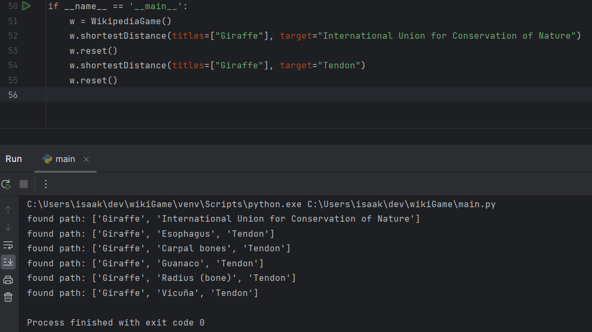

# Wiki-Game-1-hour
A fun last-hour-of-work challenge for friday to sharpen some python skills:

A script that uses a few libraries to play the python "Wikipedia Game" and find the shortest possible paths between two wikipedia pages.  Uses multi-processing to speed things up, but unfortunately the wikipedia library used is highly CPU dependant as it uses a fairly hefty XML parser to read the page text.  It is probably possible to extract page hyperlinks without "rendering" the HTML into an XML schema in memory.  This would be substantially faster, but a lot more work to implement.